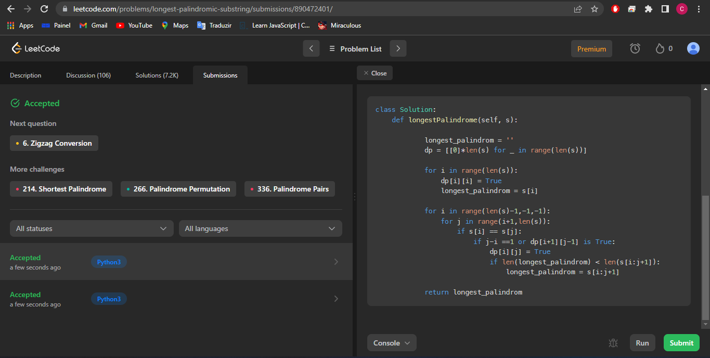
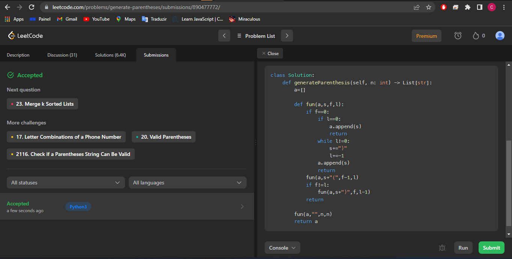

# Questões - Dupla 07

**Número da Lista**: PD 
**Conteúdo da Disciplina**: 07 

## Alunos
|Matrícula | Aluno |
| -- | -- |
| 18/0099353  |  Cibele Freitas Goudinho |
| 16/0127327  |  João Paulo Coelho de Souza |

## Sobre 
Solução de questões sobre programação dinâmica no site leetcode. 

## Screenshots
Solução da questão [5.Longest Palindromic Substring](https://leetcode.com/problems/longest-palindromic-substring/description/) em python.

Solução da questão [22.Generate Parentheses](https://leetcode.com/problems/generate-parentheses/) em python.

## Instalação 
**Linguagem**: Python 
**Framework**: N/A 
Todos códigos foram rodados no console do site leetcode.

## Outros 
Questões retiradas do site [leetcode](https://leetcode.com/tag/dynamic-programming/)

